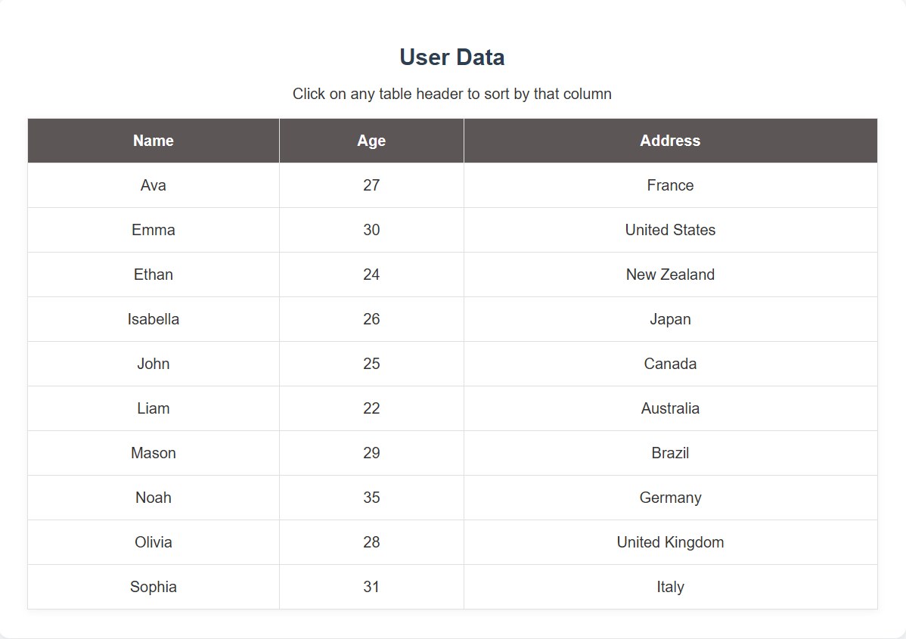
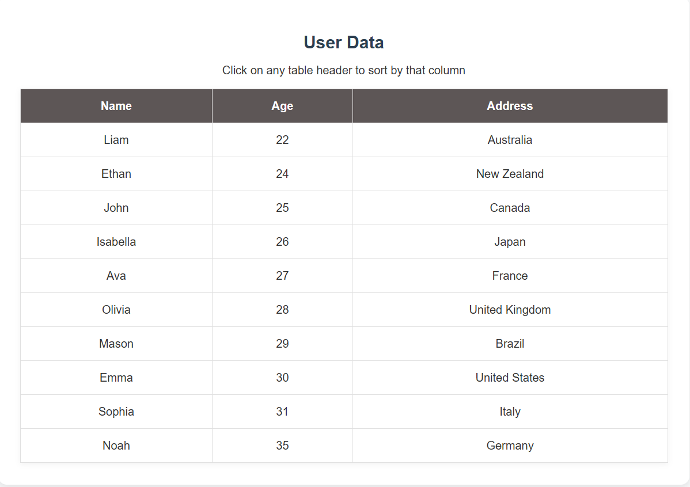

# 📊 Sortable User Data Table

A dynamic and interactive table that displays user information. It features client-side sorting functionality, allowing users to organize data by Name, Age, or Address with a single click.

## 📸 Screenshots

| Sorted by Name (A-Z) | Sorted by Age (Ascending) |
|:---:|:---:|
|  |  |

## ✨ Features

* **Dynamic Data Rendering:** Populates the table rows automatically from a JavaScript array of objects.
* **Click-to-Sort Headers:** Clicking on any column header ("Name", "Age", "Address") triggers the sort function.
* **Smart Sorting Logic:**
    * **Text:** Uses alphabetical sorting (e.g., Name, Address).
    * **Numbers:** Uses numerical sorting (e.g., Age) to ensure 2 comes before 10.
* **Toggle Order:** Clicking the same header twice toggles between Ascending and Descending order.

## 🛠️ Technologies Used

* **HTML5:** Semantic table structure.
* **CSS3:** Styling for the table layout (referenced as `style.css`).
* **jQuery (3.7.1):** DOM manipulation and event handling for the sort logic.

## 📂 Project Structure

```text
.
├── index.html      # Main structure with table headers
├── style.css       # Table styling
└── script.js       # Data array and sorting logic

```

## 🚀 How to Run

1. Clone this repository.
2. Open `index.html` in your web browser.
3. Click on **Name**, **Age**, or **Address** in the table header to test the sorting.

## 🧠 Code Highlights

**Sorting Logic (`script.js`):**
The script uses the JavaScript `.sort()` method combined with a check for data types. This ensures numbers are sorted mathematically (2, 5, 10) rather than alphabetically (10, 2, 5).

```javascript
const sortedData = [...users].sort((a, b) => {
    const valA = a[column];
    const valB = b[column];

    // Check if values are numbers for correct numeric sorting
    if (typeof valA === 'number' && typeof valB === 'number') {
        return sortColumn.ascending ? valA - valB : valB - valA;
    } else {
        // Fallback to string comparison for Name/Address
        return sortColumn.ascending
            ? valA.toString().localeCompare(valB.toString())
            : valB.toString().localeCompare(valA.toString());
    }
});

```
